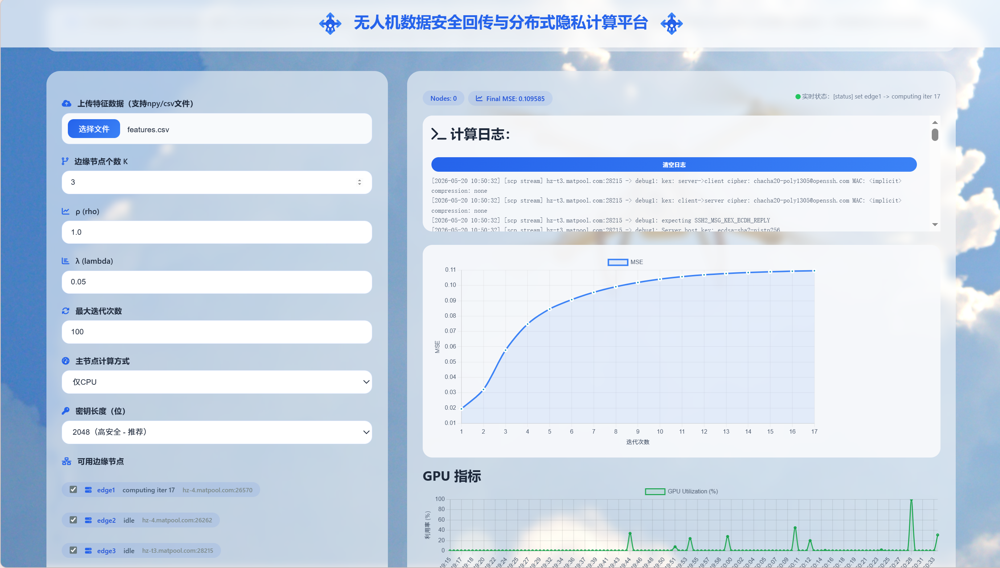
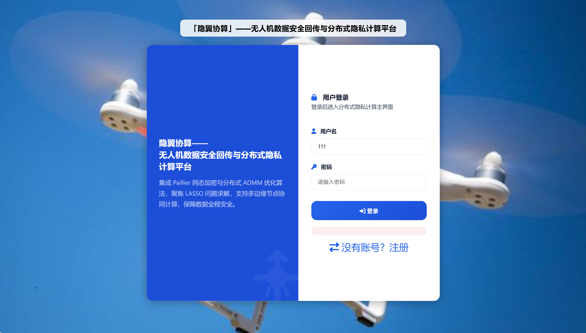

# 3P-ADMM-PC2：分布式隐私计算框架复现

该分支为3P-ADMM-PC2的web可视化应用，旨在帮助用户获得更好的交互体验，理解算法的运行机制。
---





## 目录
- [环境搭建](#环境搭建)
- [快速开始](#快速开始)
---

## 环境搭建

| 节点 | 硬件 | 说明 |
|------|------|------|
| 主节点 | RTX A4000 GPU | 负责加密、解密、z/v更新 |
| 边缘节点×3 | RTX A2000 GPU | 负责矩阵求逆、同态计算 |
### tips:本项目的分布式实验环境基于[矩池云](https://matpool.com)搭建，主节点与三台边缘节点均为矩池云GPU实例，通过矩池云提供的内网SSH互联，模拟真实的分布式边缘计算网络拓扑。
### 由于服务器资源不足，后期边缘节点配置临时改为Tesla V100，未对原有配置重新测试，但估计差别不会很大。
---

## 快速开始

### 1. 每次开机重新编译GPU库

`/tmp`目录不持久化，每次开机需重新编译：

```bash
nvcc -arch=sm_86 -O2 --compiler-options '-fPIC' \
    -dc gpu/cufft_modexp.cu -o /tmp/cufft_modexp.o

cat > /tmp/wr_cufft.cu << 'EOF'
#include <stdint.h>
extern "C" {
    void cufft_init(int N);
    void cufft_modexp(uint32_t*, uint32_t*, uint32_t*, uint32_t*, uint32_t*, int, int, int);
}
extern "C" {
void init_gpu(int N){ cufft_init(N); }
void run_modexp(uint32_t *hg, uint32_t *hm, uint32_t *hn, uint32_t *hR,
                uint32_t *ho, int N, int mb, int nb){
    cufft_modexp(hg,hm,hn,hR,ho,N,mb,nb);
}
}
EOF

nvcc -arch=sm_86 -O2 --compiler-options '-fPIC' -dc /tmp/wr_cufft.cu -o /tmp/wr_cufft.o
nvcc -arch=sm_86 --compiler-options '-fPIC' \
    -dlink /tmp/cufft_modexp.o /tmp/wr_cufft.o -o /tmp/dl_cufft.o
g++ -shared -fPIC /tmp/cufft_modexp.o /tmp/wr_cufft.o /tmp/dl_cufft.o \
    -lcuda -lcudart -lcufft -L/usr/local/cuda/lib64 -o /tmp/lib_cufft.so
```

### 2. 更新节点配置

每次开机后在矩池云控制台查看SSH地址和端口，更新`config.py`：

```python
NODES = {
    'edge1': {'host': 'xxx.matpool.com', 'port': 12345},
    'edge2': {'host': 'xxx.matpool.com', 'port': 12346},
    'edge3': {'host': 'xxx.matpool.com', 'port': 12347},
}
```

### 3. 同步代码到边缘节点

```bash
for NODE in "edge1 host1 port1" "edge2 host2 port2" "edge3 host3 port3"; do
    HOST=$(echo $NODE | cut -d' ' -f2)
    PORT=$(echo $NODE | cut -d' ' -f3)
    scp -P $PORT protocol/edge_worker.py protocol/edge_init.py \
        root@$HOST:/mnt/3p-admm-pc2/protocol/
done
```
更进一步的配置请参照[连接](https://github.com/Samarvivian/3P-ADMM-PC2/blob/features/connect.md).
### 4. 运行
在服务器终端中启动服务：
```
uvicorn web_backend:app --host 0.0.0.0 --port 8000
```
同时开启监控，方便查看实验中的计算架构使用情况：
```
GPU_MONITOR_BACKEND=http://127.0.0.1:8000 \
python3 experiments/monitor_gpu.py --interval 0.5 &
```
最后一步，在本机的终端进行ssh连接：
```
ssh -p <端口号> -NL 8000:localhost:8000 root@<主机名>
```
最后打开前端
```
http://localhost:8000/ui
```
开始你的算法之旅吧！
