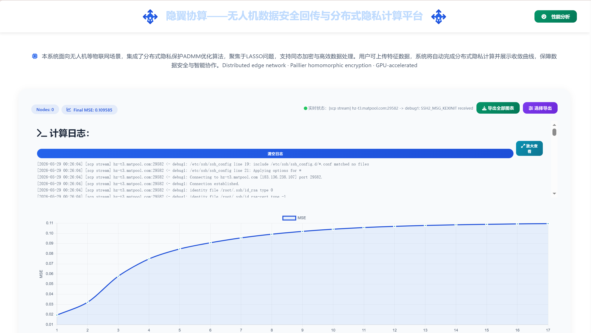

# 欢迎大家来到我们的3P-ADMM-PC2算法的可视化web界面！
首先向大家展示我们的首页（非常土请大家不要介意！）


接下来是我们的上传文件，以及选择参数的界面，这部分功能由于时间关系尚完善，欢迎大家来contribute!


最后这个界面就是我们的实时监控界面了！他支持查看我们后端运行的日志，以及每一轮的MSE,还有我们设置了毫秒级别的查看GPU利用率，显存使用情况，CPU利用率和RAM的使用情况了，怎么样，是不是有点炫酷！(bushi



那么如何快速部署我们这个小项目呢，步骤在下面：
## 环境依赖

```bash
# Python环境（推荐conda）
conda create -n myconda python=3.8
conda activate myconda

# 核心依赖
pip install gmpy2 numpy fastapi uvicorn psutil pycryptodome
```

| 依赖 | 版本 | 说明 |
|------|------|------|
| Python | 3.8+ | 推荐conda环境 |
| CUDA | 12.1 | 编译架构sm_86（A4000/A2000） |
| gmpy2 | 最新 | CPU大整数运算基准 |
| FastAPI + uvicorn | 最新 | Web后端服务 |
| numpy | 最新 | 数值计算 |
| psutil | 最新 | 系统资源监控 |
| Chart.js | 4.x | 前端可视化（CDN自动引入） |

---

## 部署步骤
### 1. 每次开机重新编译GPU库

> `/tmp`目录不持久化，每次开机需重新编译：

```bash
# Step 1：编译主kernel
nvcc -arch=sm_86 -O2 --compiler-options '-fPIC' \
    -dc /mnt/3p-admm-pc2/gpu/cufft_modexp.cu -o /tmp/cufft_modexp.o

# Step 2：生成wrapper
cat > /tmp/wr_cufft.cu << 'EOF'
#include <stdint.h>
extern "C" {
    void cufft_init(int N);
    void cufft_modexp(uint32_t*, uint32_t*, uint32_t*, uint32_t*, uint32_t*, int, int, int);
}
extern "C" {
void init_gpu(int N){ cufft_init(N); }
void run_modexp(uint32_t *hg, uint32_t *hm, uint32_t *hn, uint32_t *hR,
                uint32_t *ho, int N, int mb, int nb){
    cufft_modexp(hg,hm,hn,hR,ho,N,mb,nb);
}
}
EOF

# Step 3：编译wrapper
nvcc -arch=sm_86 -O2 --compiler-options '-fPIC' \
    -dc /tmp/wr_cufft.cu -o /tmp/wr_cufft.o

# Step 4：设备链接
nvcc -arch=sm_86 --compiler-options '-fPIC' \
    -dlink /tmp/cufft_modexp.o /tmp/wr_cufft.o -o /tmp/dl_cufft.o

# Step 5：生成共享库
g++ -shared -fPIC \
    /tmp/cufft_modexp.o /tmp/wr_cufft.o /tmp/dl_cufft.o \
    -lcuda -lcudart -lcufft -L/usr/local/cuda/lib64 \
    -o /tmp/lib_cufft.so

# 验证编译成功
ls -lh /tmp/lib_cufft.so
```

### 2. 更新节点配置

每次开机后在矩池云控制台查看SSH地址和端口，更新`config.py`：

```python
NODES = {
    'edge1': {'host': 'xxx.matpool.com', 'port': 12345},
    'edge2': {'host': 'xxx.matpool.com', 'port': 12346},
    'edge3': {'host': 'xxx.matpool.com', 'port': 12347},
}
```

### 3. 同步代码到边缘节点

```bash
# 分别替换为实际的host和port
scp -P <port1> protocol/edge_worker.py protocol/edge_init.py \
    crypto/paillier.py config.py \
    root@<host1>:/mnt/3p-admm-pc2/protocol/

scp -P <port2> protocol/edge_worker.py protocol/edge_init.py \
    crypto/paillier.py config.py \
    root@<host2>:/mnt/3p-admm-pc2/protocol/

scp -P <port3> protocol/edge_worker.py protocol/edge_init.py \
    crypto/paillier.py config.py \
    root@<host3>:/mnt/3p-admm-pc2/protocol/
```

### 4. 运行实验

**小规模验证：**

```bash
cd /mnt/3p-admm-pc2
python3 experiments/test_distributed_pc2.py
# 预期：最终MSE ≈ 0.111003，与Dis-ADMM差距 < 1e-6
```

**大规模实验（M=3000, N=27000, K=3）：**

```bash
cd /mnt/3p-admm-pc2
nohup python3 -u experiments/test_large_scale.py > /tmp/exp_log.txt 2>&1 &
tail -f /tmp/exp_log.txt
# 预期：最终MSE ≈ 0.098265，与Dis-ADMM差距 < 9.34e-4
```

### 5. 启动Web可视化平台

**终端1：启动后端**

```bash
cd /mnt/3p-admm-pc2
uvicorn web_backend:app --host 0.0.0.0 --port 8000
```

**终端2：启动资源监控采集**

```bash
cd /mnt/3p-admm-pc2
GPU_MONITOR_BACKEND=http://127.0.0.1:8000 \
    python3 experiments/monitor_gpu.py --interval 0.5 &
```

**本地访问（SSH隧道）：**

```bash
# 在本地终端执行建立隧道
ssh -p <矩池云端口> -NL 8000:localhost:8000 root@<矩池云地址>

# 浏览器访问
# 主界面（登录/上传/实时监控）
http://localhost:8000/ui
